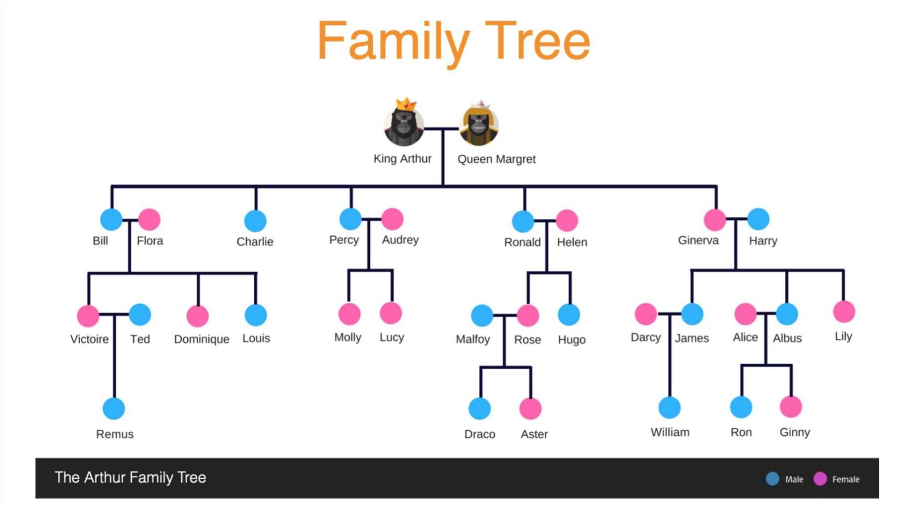

# Family in Lengaburu

This is a Kotlin application that allows you to find family relationships, including uncles, aunts, brothers-in-law, and
sisters-in-law, within a hierarchical family structure.

## Requirements

To run this application, you need to have **Docker** installed on your machine. The application will run in a Docker
container, so no additional installations are required.

## Getting Started

### 1. Clone the Repository

First, clone the repository to your local machine.

### 2. Build the Docker Image

You need to build a Docker image from the provided Dockerfile. Run the following command to build the image:

```bash
docker build -t family-relationship-app .
```

### 3. Run the Application

After building the image, you can run the application with Docker:

```bash
docker run --rm -it family-relationship-app
```

## Table of Contents

- [Overview](#overview)
- [Features](#features)
- [Data Structure](#data-structure)

## Overview



This application models a family tree and provides methods to query various family relationships for a given person.
Relationships that can be found include:

- Paternal and maternal uncles and aunts
- Brothers-in-law and sisters-in-law
- Basic sibling, parent, and child relationships

## Features

- Model families and individuals in a hierarchical structure.
- Search and retrieve specific family relationships based on names and relationship types.
- Easily extendable for additional relationship types.

## Data Structure

The family relationships are defined using two main classes:

```kotlin
data class Family(
    val husband: Person?,
    val wife: Person?,
    val parent: Family?
) {
    var children: MutableList<Family>? = null
}

data class Person(
    val name: String,
    val isChildOfParent: Boolean = false
)
